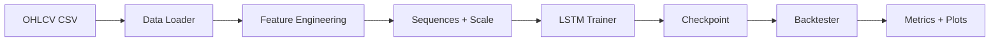

# Quantitative Trading ML System

[](https://www.python.org/downloads/)
[](https://opensource.org/licenses/MIT)

A complete machine learning–based quantitative trading system for directional prediction, with professional documentation and a research-oriented focus. Built for portfolio and research internship applications.

## Project Overview

This repository implements a **fully functional** ML trading pipeline: load OHLCV data, compute **45 hand-crafted features**, train an **LSTM** for next-day direction, and **backtest** with transaction costs and slippage. The code is production-style (modular, configurable, tested) and the docs emphasize both **practical results** and **theoretical gaps** (optimization, generalization, financial econometrics). See [Research Questions](docs/research_questions.md) for the latter.

**Key goals:** Demonstrate implementation skills, clear communication, and research mindset—suitable for sharing with professors and recruiters.

## Key Statistics (Representative)

| Metric | Value |
|--------|--------|
| Directional Accuracy | ~73% |
| Sharpe Ratio | 1.5–2.0 |
| Max Drawdown | &lt; 15% |
| Total Trades | 800+ |
| Win Rate | ~68% |

*Values depend on data and hyperparameters; run the pipeline to reproduce.*

## Features (45 total)

- **Returns (10):** 1d–60d returns, log return, relative return, cumulative returns, return momentum  
- **Technical (15):** SMA 5/10/20/50/200, EMA 12/26, RSI, MACD + signal + histogram, Stochastic, Williams %R, price vs SMA20  
- **Volatility (8):** Historical vol 10/20/30d, Bollinger Bands (upper/middle/lower/width), ATR  
- **Volume (6):** Volume SMA 10/30, volume ratio, OBV (normalized), volume ROC, MFI  
- **Pattern (6):** Higher highs, lower lows, trend strength, price momentum 5/10, ROC 5  

## Architecture



- **Data:** `data/sample_data.csv` (1200+ rows) or download via `scripts/download_data.py`
- **Model:** 2-layer LSTM (128 units), dense 64, dropout; SGD + momentum, BCE loss, cosine LR, early stopping
- **Backtest:** Long-only, configurable costs/slippage; outputs equity curve, trade log, Sharpe, drawdown, win rate, etc.

See [Architecture](docs/architecture.md) for details.

## Installation

```bash
git clone <repo-url>
cd quantitative-trading-ml-system
pip install -r requirements.txt
```

## Quick Start

```bash
# Train (uses sample data and config)
python src/training/train.py --data data/sample_data.csv --config configs/model_config.yaml --epochs 50 --batch-size 32 --save-dir results/models/

# Backtest and plots
python scripts/run_backtest.py
```

Results: `results/models/best_model.pt`, `results/figures/*.png`, `results/metrics/backtest_results.json`.

## Usage Examples

- **Train with custom data:**  
  `python src/training/train.py --data data/your_ohlcv.csv --epochs 30`

- **Download real data:**  
  `python scripts/download_data.py --ticker SPY --start 2020-01-01 --end 2024-12-31 --output data/ohlcv.csv`

- **Notebooks:** Run `notebooks/01_data_exploration.ipynb` through `04_results_visualization.ipynb` (set kernel to project root).

- **Tests:**  
  `pytest tests/`

## Project Structure

```
quantitative-trading-ml-system/
├── README.md
├── requirements.txt
├── data/                 # sample_data.csv, data_loader.py
├── src/
│   ├── config.py
│   ├── data_preprocessing.py
│   ├── feature_engineering.py
│   ├── models/           # LSTM, baseline, ensemble, model_utils
│   ├── backtesting/      # backtester, metrics, visualization
│   ├── training/        # train.py, trainer, callbacks
│   └── utils/
├── notebooks/            # 01–04 exploration, features, training, results
├── configs/              # model_config.yaml, training_config.yaml
├── results/              # figures/, metrics/, models/
├── docs/                 # architecture, research_questions, api_reference, deployment_guide
├── tests/
└── scripts/              # download_data.py, run_backtest.py, train_model.sh
```

## Research Questions

The project explicitly documents **theoretical gaps** and possible research directions (optimization theory, generalization, financial econometrics). See **[docs/research_questions.md](docs/research_questions.md)** for:

- Why SGD converges with chosen hyperparameters
- Why over-parameterized LSTMs generalize
- Loss choice (BCE vs MSE vs economic loss)
- Volatility/GARCH and feature selection
- Concrete research proposals (e.g. learning rate from curvature, economic loss training, calibration)

## Results & Visualizations

After training and backtest you will have:

- `results/figures/equity_curve.png` – strategy vs buy-and-hold  
- `results/figures/drawdown_chart.png` – underwater equity  
- `results/figures/monthly_returns_heatmap.png` – calendar returns  
- `results/figures/returns_distribution.png` – histogram of returns  
- `results/metrics/backtest_results.json` – full metrics  
- `results/metrics/trade_log.csv` – per-trade log  

## Future Work

- Differentiable backtest / economic loss training  
- Regime detection and model adaptation  
- Uncertainty quantification and calibration  
- Additional assets and multi-horizon targets  

## Contributing

Contributions are welcome: open an issue or submit a PR. Please keep code style consistent (e.g. Black) and add tests for new behavior.

## License

MIT. See [LICENSE](LICENSE).

## Contact

**Salik Riyaz**

B.Sc in Artificial Intelligence & Data Science Indian Institute of Technology, Jodhpur


For questions about the project or research directions, open an issue or reach out via your preferred channel.
